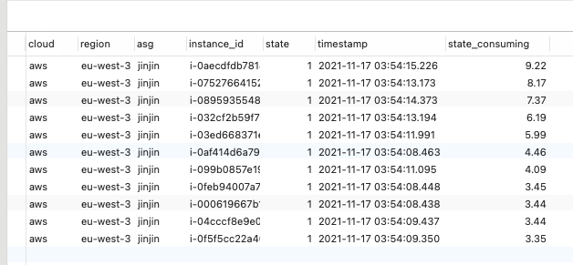
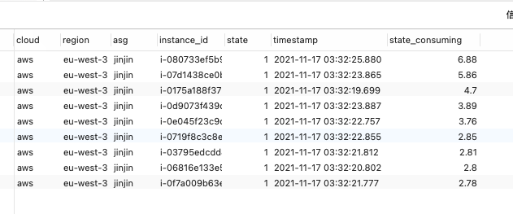

# test-aws-warn-pool
该程序只用于测试热池，开机时间与休眠功能

# 介绍

云供应商（AWS/阿里云）都提供了spot实例，由于spot实例是Ondemand实例价格的20%左右，相当的便宜，但是用spot不是一帆风顺，当供需不足时就会回收，在AWS会经常遇到大规模的中断，autoScaling伸缩组下的实例补充需要一定的时间，然而由于spot会在中断之前2分钟发出通知，用户很多时候并不能在2分钟内启动机器与添加到autoScaling，并且有效启动App，因此导致业务受影响。

# 官方热池的缺陷
所谓热池，就是开启一定数量的Ondemand实例放到池子中，然后把实例设置为停止状态，此时云商是不会对实例进行收费，只收EBS的费用。但官方的热池功能只支持单一类型的Ondemand实例，并且不支持混合实例模版，严重影响机器类型的选型使用，提高伸缩组的中断的风险

# 方案
1、实现云端支持多机型的热池功能，目的在大规模中断来时，快速的从热池中替换中断的机器，保证业务的稳定性

2、因此为了能更快的启动机器内的APP，可以把伸缩组autoScaling中的模板系统盘EBS开启加密状态，保证热池中的实例能开启休眠功能，并且等待唤醒使用，此时APP进程立刻从硬盘加载到内存，加快启动

# 开机数据
为了验证开热池与不开热池的区别，因此在同一个autoScaling做测试，模拟同时中断10次，中断后实例添加到伸缩组成功的时间

在不开热池的情况下，补充实例的时间最高达到9秒（因为云商对机器数开启的数量的限制，数量越多时间越慢）

真实线上数据，最高机器开启时间达到71秒

开启热池的情况下，补充实例时间只需要6秒左右（节约时间30%）

真实线上数据，最高也只需要10s左右

从上面的数据可以得出，热池功能可以快速的补充伸缩组所需的机器，并且有效预防大规模中断

# 休眠数据